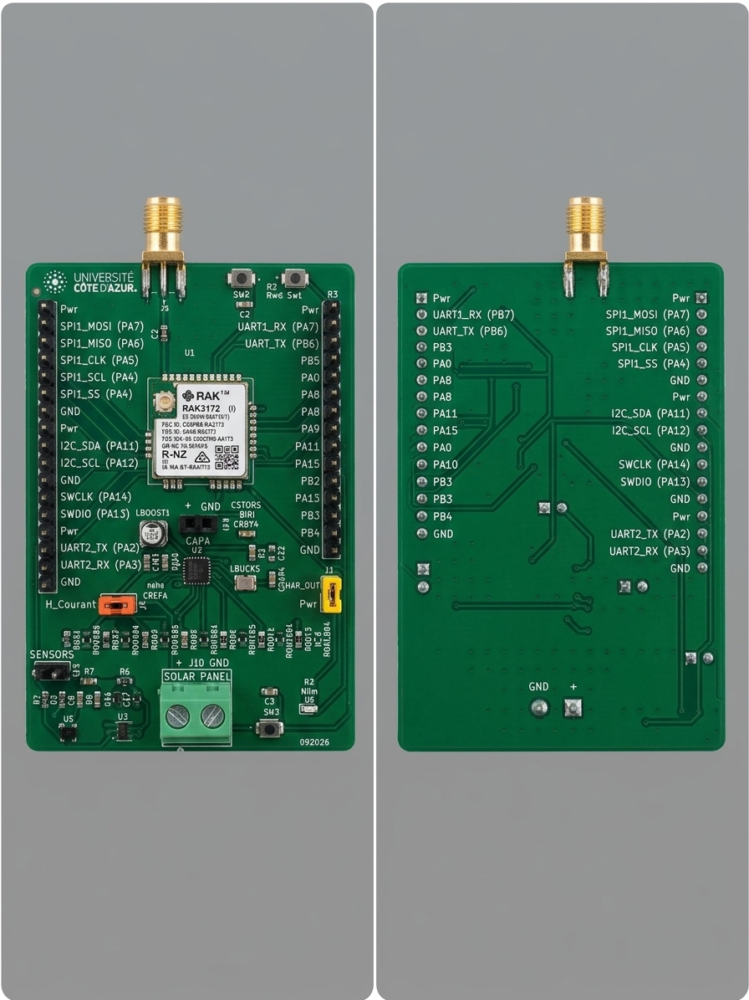

<h1 align="center">EDU RAK 2026</h1>

**EDU RAK 2026** is an educational embedded platform designed for IoT prototyping, environmental sensing, and low-power wireless communication based on RAKwireless hardware. This repository hosts all resources including schematics, hardware files.

---

## 📸 Project Overview

<p align="center">
  
</p>

---

## 🛠️ Hardware Specifications

- **Processing Core & RF:**
  - **RAKwireless RAK3172:** Low-Power LoRa module based on STMicroelectronics **STM32WLE5CC** (ARM Cortex-M4 @ 48 MHz)
  - Integrated Sub-GHz Transceiver (LoRa / LoRaWAN 1.0.3, Sigfox, P2P support)
  - Sub-GHz antenna output (868 / 915 MHz)
- **Power Architecture:**
  - **Supercapacitor supply:** Dedicated connector for supercapacitor (maintenance-free, high-cycle energy storage)
  - Ultra-low leakage and low quiescent current design optimized for intermittent energy profiles
- **Sensors:**
  - **Onboard:** Ultra-low-power 3-axis accelerometer (I2C)
  - **Footprint:** Dedicated footprint to add an optional **Bosch BME280** (Temperature, Humidity, Barometric Pressure via I2C)
- **Interfaces & Debugging:**
  - **UART2:** Serial flashing & console interface (Arduino IDE / RUI3 bootloader support)
  - **SWD:** Dedicated SWD header (`SWDIO`, `SWCLK`, `NRST`) for ST-LINK / J-Link debugging
  - Status indicator LEDs (**D1**) and User push buttons (**SW3**)

---

## 📁 Repository Structure

```text
.
├── hardware/           # Hardware design files
│   ├── schematics/     # Circuit schematics and block diagrams (PDF)
│   ├── pcb/            # PCB layout, Gerber files, BOM, Pick & Place
│   ├── 3d/             # 3D files
|   └── kicad/          # kicad project
├── datasheets/         # Component datasheets (RAK3172, sensors, etc.)
└── README.md
